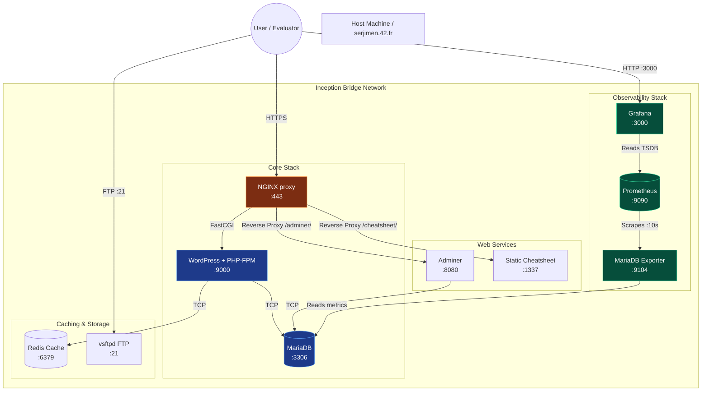

*This project has been created as part of the 42 curriculum by serjimen.*

# 🐳 Inception - System Administration with Docker

## Description
**Inception** is a foundational infrastructure project at 42. The primary goal is to broaden knowledge of system administration by deploying a robust, multi-container web architecture utilizing Docker.

This infrastructure orchestrates a mandatory core of three independent services, supplemented by seven advanced bonus services, all built from scratch on Alpine Linux (totaling **10 containers**).

### 🏗️ Architecture Diagram

**Core Architecture (Mandatory):**
- **NGINX:** The sole entry point to the core infrastructure, strictly handling HTTPS requests via TLSv1.2 and TLSv1.3. It acts as a secure Reverse Proxy for bonus web services.
- **WordPress:** The main application layer, running alongside PHP-FPM to process dynamic content.
- **MariaDB:** The backend relational database management system.

**Extended Architecture (Bonus):**
- **Redis Cache:** In-memory data structure store used to accelerate WordPress performance via object caching.
- **FTP Server (vsftpd):** Secure file transfer protocol service granting direct, chrooted access to the WordPress volume.
- **Static Website:** A lightweight, responsive HTML/CSS "Cheatsheet" served via `lighttpd` and securely routed through NGINX.
- **Adminer:** A lightweight database management interface served via PHP, securely accessible through NGINX.
- **Monitoring & Observability Stack:**
  - **MariaDB Exporter:** Connects internally to MariaDB to expose real-time database metrics.
  - **Prometheus:** A powerful time-series database configured to scrape metrics from the exporter every 10 seconds.
  - **Grafana:** Visualizes the Prometheus data via a meticulously Auto-Provisioned dashboard (zero-click setup).

The project strictly adheres to the principles of Infrastructure as Code (IaC) and containerization best practices, avoiding the use of pre-built images or process manager hacks.

## Instructions
To build and execute the project:
1. Ensure the local domain resolves to the host machine. Modify your `/etc/hosts` to include: `127.0.0.1 serjimen.42.fr`
2. Navigate to the root directory of the repository where the `Makefile` resides.
3. Deploy the core infrastructure by executing: `make up`
4. **(Recommended)** To deploy the full architecture including all 7 bonus services, execute: `make bonus`
5. The application will be securely accessible at `https://serjimen.42.fr`.

## Project Description
This project fundamentally relies on **Docker** for service orchestration, guaranteeing isolation, reproducibility, and minimal overhead. Each service is built from a minimal Alpine base image (`alpine:3.22`), ensuring a lightweight footprint and a reduced attack surface.

### Technical Comparisons & Design Choices

#### Virtual Machines vs Docker
Virtual Machines (VMs) emulate entire hardware stacks, running a full guest Operating System (OS) for each instance, which incurs significant overhead in terms of CPU, RAM, and disk space. In contrast, Docker utilizes containerization technology. Containers share the host OS kernel and isolate application processes natively via namespaces and cgroups. This design choice makes Docker substantially more lightweight, faster to instantiate, and less resource-intensive.

#### Secrets vs Environment Variables
Environment variables (`.env`) are suitable for non-sensitive configuration data (e.g., domain names, standard usernames) but are inherently insecure for sensitive credentials, as they can be easily exposed via `docker inspect` or leaked in process logs. **Docker Secrets** mitigate this risk by securely transmitting confidential data directly into a temporary file system (`/run/secrets/`) mapped to RAM within the container, preventing exposure during image builds or runtime introspection. 

#### PID 1 Enforcement
A strict requirement of this project is that the primary service in each container must run as PID 1 (Process ID 1). This is achieved using the `exec` command in the entrypoint scripts. If the primary service hangs or crashes, the container dies gracefully. Hacks like `tail -f /dev/null`, `sleep infinity`, or running services as background daemons (`&`) are strictly prohibited and avoided.

#### Docker Network vs Host Network
Using the host network maps container ports directly to the host's network interfaces, removing network isolation. This project implements a custom bridged Docker network (`inception`). This design choice provides a secure, isolated sub-network where services can communicate internally via DNS resolution. The only explicitly exposed ports to the external host network are NGINX (443), FTP (21, plus passive range), and Grafana (3000).

#### Docker Volumes vs Bind Mounts
Docker Volumes are storage mechanisms completely managed by Docker, typically stored within `/var/lib/docker/volumes/`, offering seamless integration and abstraction. However, this project mandates the use of **Bind Mounts**, linking specific directories on the host filesystem (`/home/serjimen/data/...`) directly to paths inside the containers. This ensures that critical database and application data persists transparently on the host machine, independent of container lifecycle, while granting direct access to the files from the host OS.

## Resources
The development of this project relied on official documentation and community standards:
- Docker Documentation: https://docs.docker.com/
- Alpine Linux Wiki: https://wiki.alpinelinux.org/
- NGINX Official Documentation: https://nginx.org/en/docs/
- MariaDB Server Documentation: https://mariadb.com/kb/en/
- Grafana Auto-Provisioning: https://grafana.com/docs/grafana/latest/administration/provisioning/
